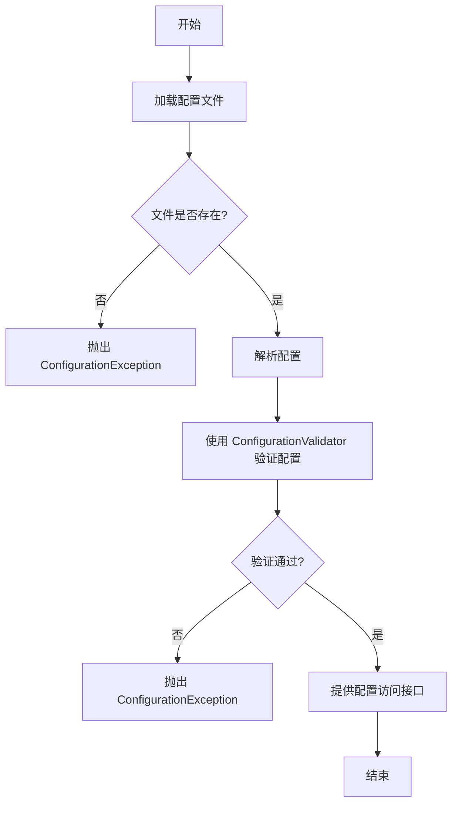

# PHP Packer Config 工作流程（Mermaid）

```mermaid
flowchart TD
    A[开始] --> B[加载配置文件]
    B --> C{文件是否存在?}
    C -- 否 --> D[抛出 ConfigurationException]
    C -- 是 --> E[解析配置]
    E --> F[使用 ConfigurationValidator 验证配置]
    F --> G{验证通过?}
    G -- 否 --> H[抛出 ConfigurationException]
    G -- 是 --> I[提供配置访问接口]
    I --> J[结束]
```

## 说明

- 配置加载与验证是核心流程。
- 验证不通过或文件不存在会直接抛出异常，阻断后续流程。
- 验证通过后，外部即可通过接口安全访问各项配置。
